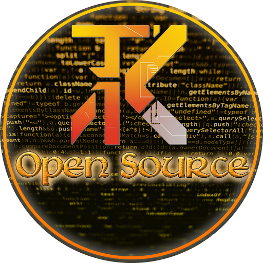

# TK Dev Tools

<p align="center">
  
</p>

**TK Dev Tools** is a set of tools designed to make the daily work of an OTAdmin easier.

The project is meant to grow over time and collect useful utilities in one place, with a simple, direct, and easy-to-maintain interface.
Right now the app is still in its early stage and the available module is the **GIF Generator**, but the foundation is ready for more tools in the future.

## What it does today

At the moment TK Dev Tools offers:

- item GIF generation directly from `SPR` and `DAT` files
- a top bar with quick actions
- a button to open the project Discord servers
- a button to check file integrity against the official GitHub repository
- an optional log panel that is disabled by default

## Requirements

- Python 3.10+
- internet access for the first launch if dependencies are missing

The launcher now checks the environment automatically and installs any missing Python packages before opening the main app.

## How to run

You can start the app with:

```bash
python launcher.py
```

If you prefer, you can also open the Qt window directly with:

```bash
python qt_ui.py
```

If the environment is missing dependencies, launch `launcher.py` first so it can install them and then open the main window automatically.

### Windows launcher

If you want a double-clickable entry point on Windows, use [`tk-dev-tools.bat`](tk-dev-tools.bat).
It checks whether Python is available, installs the latest Python runtime manager through WinGet if needed, and then launches the project.

## Interface

The main window was arranged so the most important actions stay visible:

- **Enable/Disable log**: shows or hides the log panel. It starts disabled by default.
- **About**: shows project information and the creator credit.
- **Discord**: opens a menu with the project servers.
- **Check integrity**: compares the local files with the official repository and automatically restores any divergent or missing file.

### Project Discords

- **Canary**: https://discord.gg/gvTj5sh9Mp
- **TK Dev**: https://discord.gg/rj97H4JD3k

## GIF Generator

The current module of the project is **GIF Generator**, which reads Tibia client files and generates animated GIFs for items.

It uses:

- `SPR file`
- `DAT file`

The output is saved as `items/<client_id>.gif` inside the chosen output folder.

### What it is for

This feature is useful for:

- generating visual previews of items
- building item catalogs and item lists with images
- automating a task that is usually manual and repetitive

### How to use it

1. Open the application.
2. Select the client version.
3. Choose the `SPR` file.
4. Choose the `DAT` file.
5. Set the output folder.
6. Adjust the options you want.
7. Click **Generate GIFs**.

### Available options

- **Only pickable items**: generates only items that can be picked up.
- **Use ID range**: limits generation to a specific ID range.
- **Frame delay (ms)**: sets the fallback delay between frames when the `DAT` file does not provide enhanced timing data.
- **Workers**: controls how many workers are used to process items in parallel.

### GIF timing

When the `DAT` file contains enhanced animation data, the application uses the per-frame timings stored in the file itself.
If that data is not available, the program uses the value defined in **Frame delay (ms)**.

## File integrity

The **Check integrity** button checks the official project repository at:

- [`LeoTKBR/tk-dev-tools`](https://github.com/LeoTKBR/tk-dev-tools)

It compares the local files against the official GitHub tree and, if it finds any mismatch, downloads the problem file again to restore the correct version.

## Project structure

- [`launcher.py`](launcher.py): application entry point
- [`bootstrap_ui.py`](bootstrap_ui.py): Qt setup window for dependency installation
- [`dependency_bootstrap.py`](dependency_bootstrap.py): dependency detection helpers
- [`qt_ui.py`](qt_ui.py): Qt interface
- [`generation_core.py`](generation_core.py): GIF generation logic
- [`dat_core.py`](dat_core.py): `DAT` reading and parsing
- [`spr_core.py`](spr_core.py): `SPR` reading and parsing
- [`core_types.py`](core_types.py): shared project types

## Next steps

The project is designed to grow with new tools focused on admin workflow.
GIF Generator is only the first module in that foundation.
