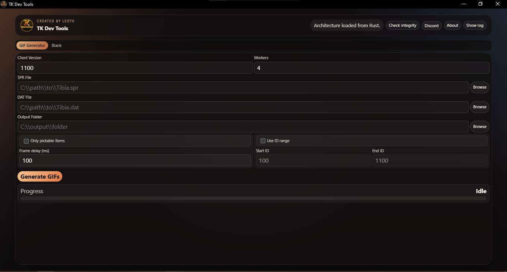

# TK Dev Tools

<p align="center">
  
</p>

## Requirements

- Windows 10 or newer
- Node.js 22+
- Rust toolchain with `cargo`
- Tauri CLI dependencies installed through `npm install`

## How to Use

### Development

```bash
npm install
npm run tauri dev
```

### Production Build

```bash
npm run tauri build
```

The release build generates:

- `src-tauri/target/release/TK Dev Tools.exe`
- installer bundles under `src-tauri/target/release/bundle/`

## Project Details

TK Dev Tools is a Tauri-based desktop app that currently serves as the migration shell for the original toolkit.

### Current Focus

- React UI shell for the app workspace
- Rust command bridge for file selection, generation, logs, and integrity checks
- Windows packaging with branded icon and installer output

### Main Features

- GIF generator workspace
- Integrity check against the upstream repository
- File pickers for SPR, DAT, and output folders
- Progress events and live logs
- About dialog and branded app shell

### Screenshots

<p align="center">
  
  <br />
  <sub>GIF Generator</sub>
</p>

### Branding and Packaging

- App title: `TK Dev Tools`
- Executable name: `TK Dev Tools.exe`
- Main icon source: `public/icon.png`
- Bundle icons generated into `src-tauri/icons/`

### Notes

- The `dist/` folder is generated by Vite and should not be edited manually.
- The `src-tauri/target/` folder is generated by Rust/Tauri builds and can be safely recreated.
- If Windows shows an old icon after rebuilding, it may be a shell cache issue rather than a build issue.
